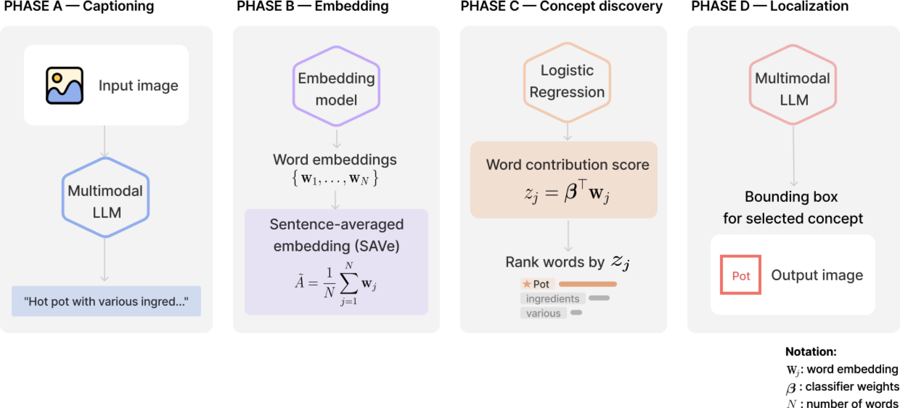

# TEBOL — Text-Based Embedding for Object Localization

A novel method for interpretable image classification that explains predictions
through semantic concepts rather than visual saliency.
Five binary pairs: acousticguitar/violin, ambulance/firetruck, ant/bee,
cucumber/zucchini, hotpot/vase.

The whole pipeline on one photograph, end to end, is in
[`notebooks/tebol_pipeline.ipynb`](notebooks/tebol_pipeline.ipynb).



## Pipeline

| phase | step | script |
|---|---|---|
| **A — Captioning** | A vision model describes each photograph, 8 lengths × 5 repetitions. | `01_caption.py` |
| **B — Embedding** | Every distinct word is embedded once; a caption is the mean of its word vectors. | `02_embed.py` |
| **C — Concept discovery** | Logistic regression classifies that mean, 5-fold CV × 5 repeats. | `03_train_smer.py` |
| | SMER scores each word by its contribution, and ranks them. | `03_train_smer.py` |
| | LIME explains the same captions, as the comparison. | `09_lime.py` |
| | AOPC tests both rankings by deleting their top words. | `07_aopc.py` |
| **D — Localization** | The top-ranked words go back to the vision model, which returns a box for them. | `23_bbox.py` |

## Evaluation baselines

Each baseline answers the same question as the pipeline, with one step of it
taken away, so the accuracy it loses is what that step contributes. All are
scored on the same images, the same 5 × 5 folds and the same image-level rule.

| baseline | what it does | phase compared |
|---|---|---|
| **LR no-class** | the same classifier on captions with the class word deleted | A — what the description carries once the label is gone |
| **name in text** | string matching: looks for either class name in the caption text, no model | C — is the classifier doing more than reading the label |
| **zero-shot** | asks the same vision model to classify the image directly | A–C — did captioning and training beat asking it outright |
| **CLIP / CoCa** | picks the nearer of two class prompts by cosine similarity | A–C — can a small untrained model do it without captions |
| **CLIP / CoCa probe** | the same classifier on frozen image vectors, the encoder never shown a class name | A–B — is a caption a better representation than the image |

Accuracy at 5-word captions, image level, ± is the 95% half-width:

| pair | LR caption | LR no-class | name in text | zero-shot | CLIP | CLIP probe | CoCa | CoCa probe |
|---|---|---|---|---|---|---|---|---|
| acousticguitar/violin | **0.9907** ±.001 | 0.8177 ±.006 | 0.8440 ±.012 | 0.9848 ±.004 | 0.9737 ±.005 | 0.9822 ±.002 | 0.9788 ±.005 | 0.9830 ±.002 |
| ambulance/firetruck | 0.9852 ±.002 | 0.8794 ±.007 | 0.9225 ±.010 | 0.9853 ±.004 | 0.9822 ±.005 | **0.9861** ±.002 | 0.9787 ±.005 | 0.9788 ±.002 |
| ant/bee | **0.9849** ±.002 | 0.8868 ±.005 | 0.8975 ±.010 | 0.9772 ±.005 | 0.9426 ±.008 | 0.9689 ±.003 | 0.9384 ±.008 | 0.9606 ±.003 |
| cucumber/zucchini | **0.9410** ±.004 | 0.7087 ±.010 | 0.8191 ±.015 | 0.8882 ±.013 | 0.6709 ±.019 | 0.8242 ±.005 | 0.7150 ±.018 | 0.8240 ±.005 |
| hotpot/vase | 0.9976 ±.001 | 0.9967 ±.001 | 0.6460 ±.019 | 0.9980 ±.002 | 0.9951 ±.003 | **0.9992** ±.001 | 0.9980 ±.002 | 0.9988 ±.001 |

Intervals are not the same kind and should not be compared as widths: a
t-interval over 25 folds where a model is refit, a bootstrap over images where
it is not. Paired differences and significance are in
[`results/metrics/baselines_w05.csv`](results/metrics/baselines_w05.csv).

```
python scripts/24_baselines.py run --pair ant_bee --baseline clip
python scripts/24_baselines.py table
```

## More than two classes

The decomposition does not depend on there being two classes: it needs mean
pooling and the logit to be linear, and both hold for any number. Run on
cucumber, zucchini and hotpot, one-vs-rest so each class gets its own weight
vector and each word one score per class, it rebuilds every logit to 5e-06 —
float32 rounding. Image-level accuracy 0.9500 ±.003, and hotpot is 99.6%
correct while the two vegetables take 6.0% and 5.5% of each other.

Worked example: [`notebooks/tebol_multiclass.ipynb`](notebooks/tebol_multiclass.ipynb).

```
python scripts/25_multiclass.py
```
